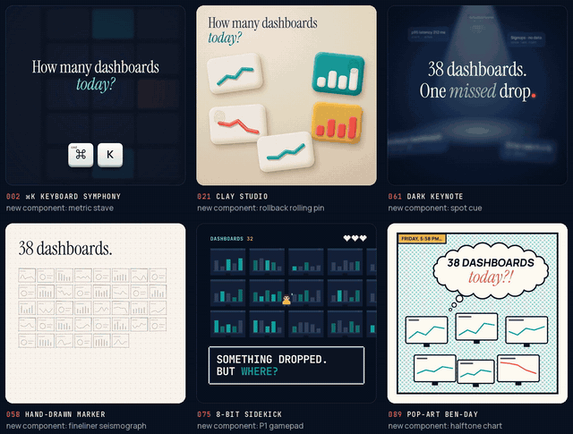

# Same story, six films



One 12-second script. Six themes from the [gallery](https://tugrawork-creator.github.io/saas-motion-kit/). Six films that share the story and nothing else.

This is the kit's one rule, shown instead of told: **no two films should feel like the same film.** Every film here went through the same creative pass: a Message & tone sentence, a one-row-per-shot ledger, the [variety audit](../../tools/variety_audit.py) until it printed "no repetition found", and at least one component invented for this film only.

▶ Watch the grid and each film in full on the [v1.2 release](https://github.com/tugrawork-creator/saas-motion-kit/releases/tag/v1.2).

## The shared script

| time | beat | what every film has to say |
|---|---|---|
| 0–3 s | hook | the pain: too many dashboards, and the drop is found too late |
| 3–4.5 s | reveal | Acme Pulse arrives in the theme's own language |
| 4.5–9 s | proof | Pulse flags **Checkout conversion −18% · since 09:42**, and a human presses **Roll back** |
| 9–12 s | CTA | "You ship. *Pulse watches.*" and **Start free**; the last 0.8 s holds still |

1080×1080, 30 fps, silent. Acme and Acme Pulse are fictional, and so are the numbers.

## The six films

| film | tone arc | new component | transition families | the surprise |
|---|---|---|---|---|
| [002 ⌘K Keyboard Symphony](002-cmd-k-keyboard-symphony/) | technical → bold → trustworthy → warm | **metric stave**: the metric played as notes on a five-line staff | cut, carry ×2, camera | the camera drops onto the ⌥ R keycaps as the human strikes |
| [021 Clay Studio](021-clay-studio/) | playful → bold → trustworthy → warm | **rollback rolling pin**, with a thumbprint seal on the pressed button | cut, carry, camera, mask | instead of a toast, the clay itself gets kneaded flat |
| [058 Hand-Drawn Marker](058-hand-drawn-marker/) | urgent → bold → trustworthy → warm | **fineliner seismograph**: a pen draws the metric live, then becomes the CTA underline | mask, material, camera, carry | a giant eraser scrubs the whole page clean |
| [061 Dark Keynote](061-dark-keynote/) | mysterious → premium → trustworthy → warm | **spot cue**: a follow-spot used as a UI state | carry, camera, mask, cut | the house lights cut to navy before the last spot clicks on |
| [075 8-Bit Sidekick](075-8-bit-sidekick/) | nostalgic → playful → urgent → celebratory → warm | **P1 gamepad**: a real thumb reaches into the pixel world and presses A = ROLL BACK | material, camera, mask, time, cut | Roll back literally rewinds the level for twelve frames |
| [089 Pop-Art Ben-Day](089-pop-art-ben-day/) | wry → bold → urgent → trustworthy → warm | **halftone chart**: dot size carries the value, so the drop thins the ink | mask, camera ×2, carry, cut, material | the three close-ups turn out to be one comic page |

Each folder has the film's `STORYBOARD.md` (tone sentence and ledger), `index.html` (the whole film), a README with its transitions and checks, and its fonts under the SIL OFL.

## What the six share, and what they don't

- **Shared:** the script, the Acme tokens, coral only for the anomaly and the CTA, a designed poster frame at 0 s and a still last 0.8 s.
- **Not shared:** every entrance, every transition, the motif, the camera language and the new component.

The new components came from one question: *what does this theme's medium do with the verb "decide"?* A keyboard strikes a key. Clay keeps a thumbprint. A keynote calls a light cue. A game asks Player 1 to press A. A comic points a finger. A notebook gets a pen line. That is the [component forge](../../creative/component-forge.md) at work.

## Make film number seven

1. Pick a theme that isn't one of these six:
   ```bash
   python tools/pick_themes.py --tone premium --audience "developers b2b" -n 5
   ```
2. Give [`BRIEF.md`](BRIEF.md) to your agent with that theme number. It is the brief these six were built from, with the paths made relative.
3. The creative pass is part of the brief, so the storyboard has to pass `python tools/variety_audit.py STORYBOARD.md` before the build starts.

## How they were made

Six Claude Code agents with the HyperFrames skills worked in parallel from the same brief, one theme each. Every film was checked with `hyperframes lint` (0 errors), `hyperframes snapshot` and `hyperframes check` (0 errors, text contrast WCAG AA), and rendered at 1080×1080. The grid was put together with ffmpeg from the six renders, all starting on the same frame, so the beats line up across all six.
