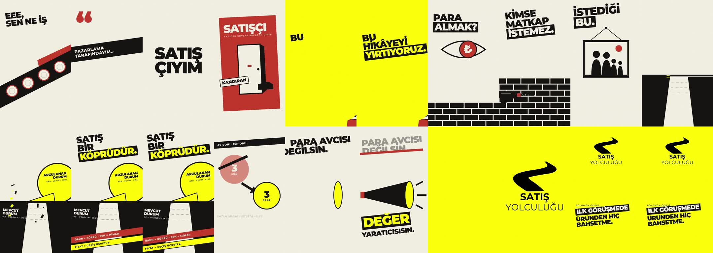

# Satış Yolculuğu · "Satış bir köprüdür" bölüm fragmanı

70 sn · 1080×1920 (4K master 2160×3840) · 30 fps · müzik yerine sentez ritim yatağı + sıcak SFX



- **Tema:** [085 Constructivist Agitprop](../../docs/themes/085-constructivist-agitprop.html). Krem kâğıt, mürekkep ve logonun sarısı. Her şey sert çaprazlarda duruyor; çarpma anlarında kıymıklar dağılıyor.
- **Mesaj ve ton:** "Satış birinden para almak değil, dönüşüm yaratmaktır" mesajını manifesto tonunda veriyor. İzleyici "ben satışçıyım" demekten gurur duymalı.
- **Kaynak:** Yalnızca bölüm transkripti. Ekrandaki her kelime ve rakam bölümden geliyor.
- **Yeni bileşenler:**
  - `word-clamp`: "SATIŞÇIYIM" iki kama arasında boğuluyor.
  - `diagonal-poster-rip`: eski satışçı afişi sarı bir kesikle çapraz yırtılıyor.
- **Motif:** Sarı kama üç kez dönüyor ve her seferinde büyüyor: önce yırtık, sonra köprü, en son logodaki yol.
- **Geçişler:**
  - whip pan
  - beat cut + hold frame
  - yırtma maskesi
  - nesne taşıma (duvar)
  - push-through
  - line-to-horizon
  - focal iris
  - şekil match cut
  - renk match (megafonun sarısı logonun zemini oluyor)
- **Denetim:** `variety_audit.py` "no repetition found" verdi. `hyperframes check` geçti.
- **Ses:** `assets/audio/make_score.py` sesi sample kullanmadan, tohumlu ve deterministik olarak üretiyor. Seviye -14 LUFS.

## Yeniden üretmek

```bash
python assets/audio/make_score.py          # score.wav → loudnorm ile score.m4a
npx hyperframes check
npx hyperframes render --quality delivery --resolution portrait-4k --output renders/satis-yolculugu-fragman-2160x3840.mp4
../../tools/deliver.sh renders/satis-yolculugu-fragman-2160x3840.mp4 1080x1920 renders/satis-yolculugu-fragman-1080x1920.mp4
```

GSAP 3.14.2 `assets/js/` içinde yerel olarak duruyor, çünkü render ortamı CDN'e erişemiyor. Montserrat (SIL OFL 1.1) `latin-ext` alt kümeleriyle `assets/fonts/` içinde.
